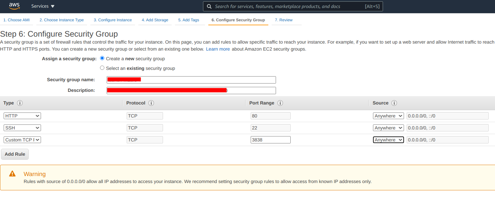

# Template for deploying a Shiny app with Docker

In this repository you can find the code to run a R shiny app with docker. In the first part of this README you will find instructions to do it. In the second part you can find instructinos to run it in AWS.

Any doubts or corrections, open an issue or send me a mail to ge.vargasn@gmail.com

### Running a shiny with Docker

I assume you have installed [docker](https://www.docker.com/products/docker-desktop) on your pc. It would be enough with having the docker engine, but installing the default Docker Deskop is also good, as it has the other one inside.

Clone this repository in some location on your pc. Open the terminal and go to the `shiny_docker_exampple` you just cloned. With the next command you will build the image from the Dockerfile (if you are using Windows, just remove the `sudo`):

```
sudo docker build -t shiny_image .
```

With this you have created two imagens: `shiny_image` and `rocker/shiny`. Let's run `shiny_image` in a container named `shiny_app` with the next command (again, if you are in windows, don't use the `sudo`):

```
sudo docker run --name=shiny_app --rm -p 80:3838 shiny_image
```

Now, if you go to [http://0.0.0.0/](http://0.0.0.0/) we can see that the app is running.


### Running a shiny with docker in AWS

Launch an instance in the cloud. I have used Ubuntu Server 20.04 LTS/64 bits (x86)/t2.micro and the next options for the security 




